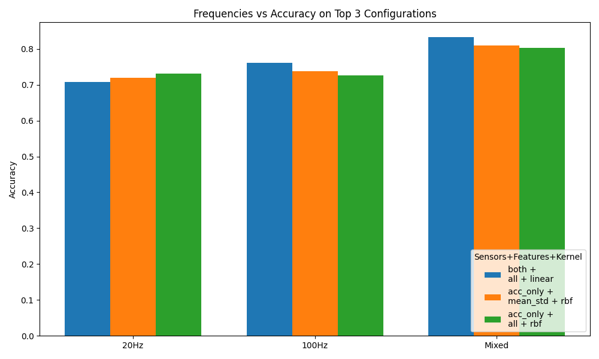
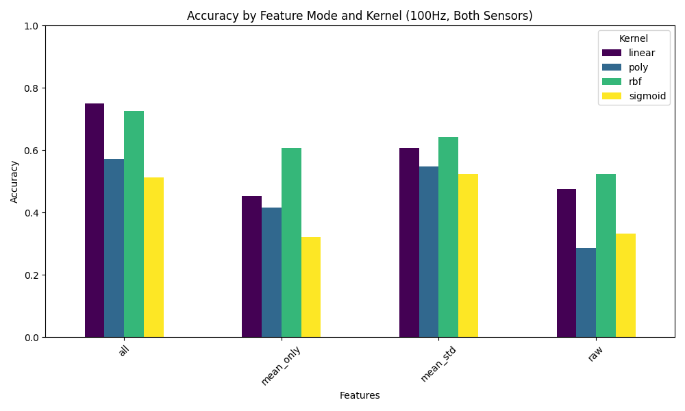
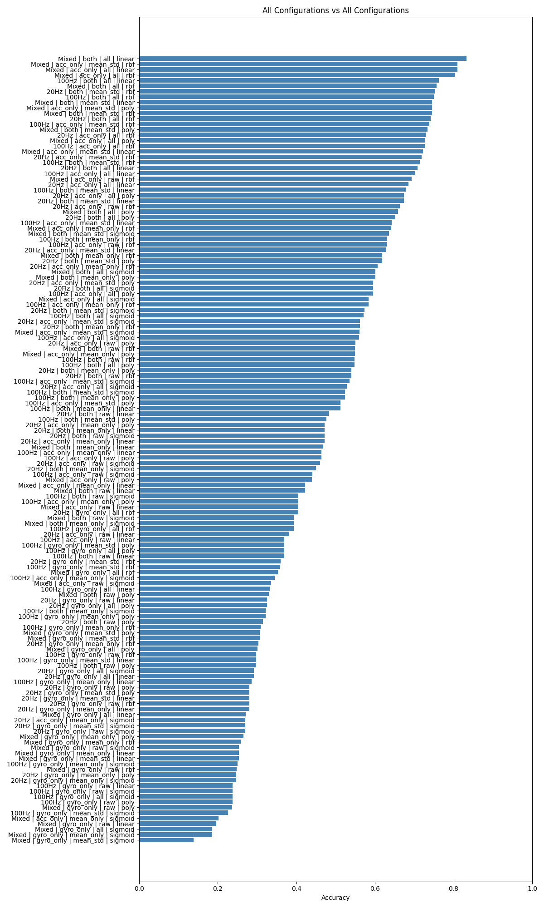
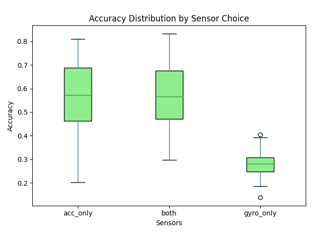
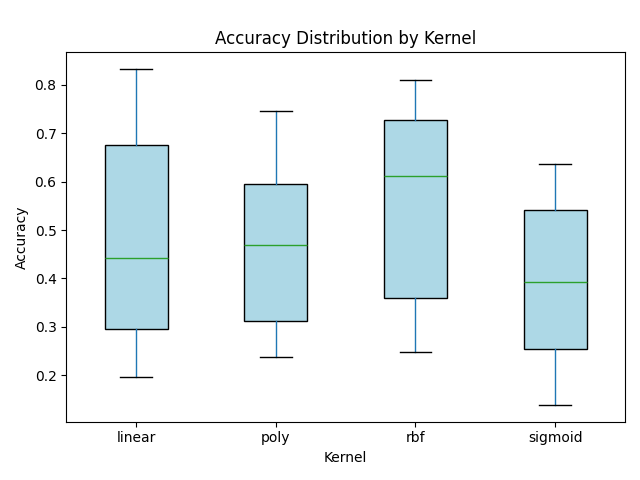
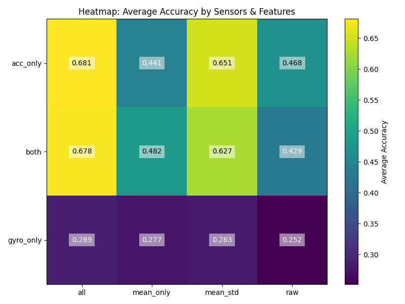

# Assignment 03 - Activity Recognition

## Overview

This project implements a real-time activity recognition system using sensor data from the DIPPID application and a machine learning classifier based on scikit-learn.

The application predicts activities continuously and visualizes the prediction with pyglet.

## Important Files

### `gather_data.py`

Records accelerometer and gyroscope data from DIPPID and stores recordings as CSV files.

### `activity_recognizer.py`

Handles:

* loading datasets
* feature extraction
* train/test split
* training the SVM classifier
* activity prediction

### `feature_extraction.py`

Extracts statistical features from sensor data.

The following features are used:

* mean
* standard deviation
* minimum
* maximum

Using statistical features produced more stable predictions than using raw sensor values directly.

### `dataset_loader.py`

Loads all CSV recordings recursively from the data directory.

### `fitness_trainer.py`

Main application.

This file:

* trains the classifier at startup
* receives real-time DIPPID sensor data 
* continuously predicts activities
* updates the pyglet UI

### `evaluation.py`

Used to compare different kernel functions and evaluate classifier performance.

## Pre-processing and Feature Extraction

Raw sensor values resulted in unstable predictions due to temporal noise and alignment jitter. To solve this, we tested calculating summary statistics over the time window.

Extracting statistical features vastly improved prediction stability and realtime consistency over the raw sequential data. The raw sequences peaked around `~67.42%` accuracy, while our expanded statistical matrices reached `~83.82%`.

## Classifier Evaluation

Different variations of sampling rates (20Hz, 100Hz, Mixed), SVM kernels (linear, poly, rbf, sigmoid), sensor inclusions (accelerometer only, gyroscope only, both), and input features (raw, mean only, mean & std, and all stats) were thoroughly tested.

### 1. Frequencies and Sensor Combinations
We evaluated whether higher sampling rates or including both gyroscope and accelerometer data improved results.

Surprisingly, the **Mixed** dataset (using both 20Hz and 100Hz simultaneously) performed the best, acting as a form of data augmentation. Using **both** accelerometer and gyroscope sensors yielded significantly higher accuracy than using either alone.

### 2. Feature Modes vs. Kernel Performance
We evaluated incrementally adding statistical properties vs the kernel type. 

Adding all four summary statistics (mean, std, max, min) significantly outperformed using mean values alone.

### 3. Exhaustive "All vs All" Benchmark
Every possible hyperparameter combination (144 total tests) was calculated and ranked:

The best overall setup leverages a **linear** kernel on a **Mixed** frequency dataset using **all** features from **both** sensors. 

## Advanced Diagnostics

To generalize hyperparameter behaviors, we generated boxplots and heatmaps of our data pipeline distribution.

## Realtime Prediction

The application continuously receives accelerometer and gyroscope data from the DIPPID device.

Sensor values are temporarily stored inside a rolling buffer before prediction.

This prevents predictions from changing too rapidly and improves classifier stability.
